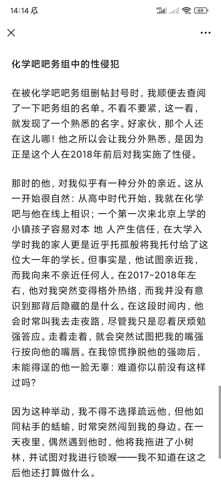
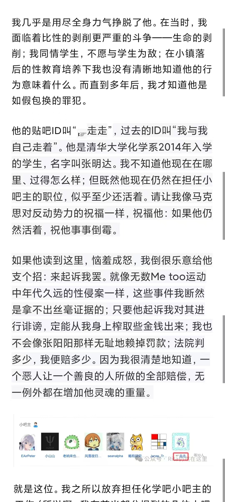
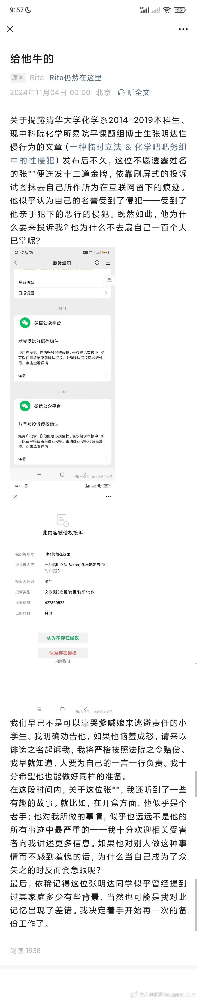
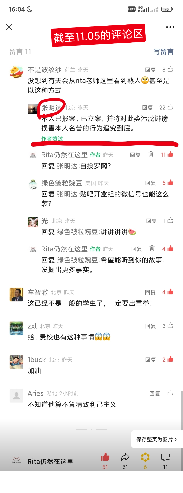

# 清华大学化学系2014-2019本科生、现中科院化学所易院平课题组2022级博士生张明达对本人的性侵行为

我，马钰淼，公众号Rita仍然在这里的号主人，决定揭露清华大学化学系2014-2019本科生、现中科院化学所易院平课题组2022级博士生张明达在2017年底到2018年间对本人的性侵行为。事情经过见下文。

张明达是一个很牛的人，连发十二道金牌，靠刷屏式的投诉要求腾讯官方删除相关内容。虽然一部分投诉被打回，但架不住以量取胜，相关内容仍然被删。他自称已报案并立案，要将对他的“造谣污蔑”追究到底——可真行啊，一个恶人，一个潜在的罪犯，居然要去追究他所害的人的责任！

我所面临的情况，是千千万万的其他人面临的情况。性教育的缺乏使得我们在受到侵害时不知道它是何性质、可以找谁求助，当我们终于有了足够的社会经验时早已过去太久。性侵犯往往突然袭击，专找无人处，受害者留不下任何证据。而当受害者决定将亲身经历讲述出来时，就会被那些混账扣上造谣污蔑的帽子——他们是不会反省的，他们从来不会因为自己的所作所为而自打一千零一个耳光。他们只会通过对受害者施加更深的伤害来保全自己。他们是社会里的吸血鬼。
可是，没有一种道理说受害者必须沉默。谁伸手堵住我的嘴，我便要咬下他的一块肉来。因为这就是正确的事情。

# 我所发表的第一篇与他相关的文章：化学吧吧务组中的性侵犯

在被化学吧吧务组删帖封号时，我顺便去查阅了一下吧务组的名单。不看不要紧，这一看，就发现了一个熟悉的名字。好家伙，那个人还在这儿哪！他之所以会让我分外熟悉，是因为正是这个人在2018年前后对我实施了性侵。

那时的他，对我似乎有一种分外的亲近。这从一开始很自然：从高中时代开始，我就在化学吧与他在线上相识；一个第一次来北京上学的小镇孩子容易对本 地 人产生信任，在大学入学时我的家人更是近乎托孤般将我托付给了这位大一年的学长。但事实是，他试图亲近我，而我向来不亲近任何人。在 2017~ 2018 年左右，他对我突然变得格外热络，而我并没有意识到那背后隐藏的是什么。在这段时间内，他会时常叫我去走夜路，尽管我只是忍着厌烦勉强答应。走着走着，就会突然试图把我的嘴强行按向他的嘴唇。在我惊慌挣脱他的强吻后，未能得逞的他一脸无辜：难道你以前没有这样过吗？

因为这种举动，我不得不选择疏远他，但他如同粘手的蛞蝓，时常突然闯到我的身边。在一天夜里，偶然遇到他时，他将我拖进了小树林，并试图对我进行锁喉——我不知道在这之后他还打算做什么。

我几乎是用尽全身力气挣脱了他。在当时，我面临着比性的剥削更严重的斗争——生命的剥削；我同情学生，不愿与学生为敌；在小镇落后的性教育培养下我也没有清晰地知道他的行为意味着什么。而直到多年后，我才知道他是如假包换的罪犯。

他的贴吧ID叫“ 走走 ” ，过去的ID叫“ 我与我自己走着” 。他是清华大学化学系2014年入学的学生，名字叫张明达。 我不知道他现在在哪里、过得怎么样；但既然他现在仍然在担任小吧主的职位，似乎至少还活着。请让我像马克思对反动势力的祝福一样，祝福他：如果他仍然活着，祝他事事倒霉。

如果他读到这里，恼羞成怒，我倒很乐意给他支个招：来起诉我罢。就像无数Me too运动中年代久远的性侵案一样，这些事件我断然是拿不出丝毫证据的；只要他起诉我对其进行诽谤，定能从我身上榨取些金钱出来；我也不会像张阳阳那样无耻地赖掉罚款；法院判多少，我便赔多少。因为我很清楚地知道，一个恶人让一个善良的人所做的全部赔偿，无一例外都在增加他灵魂的重量。

# 我所发表的第二篇与他相关的文章

# 截至2024.11.05的评论区

# 公安机关立案告知书

# Mingda Zhang, Tsinghua & CAS Student, Accused of Sexual Assault

I, Yumiao Ma, owner of the WeChat public account "Ritamatabishoujo," am coming forward to expose the sexual assault I endured at the hands of Mingda Zhang between late 2017 and 2018. Mingda Zhang was an undergraduate student in the Department of Chemistry at Tsinghua University from 2014 to 2019 and is currently a doctoral student in the Yuanping Yi's research group at the Institute of Chemistry, Chinese Academy of Sciences.

Mingda Zhang, a man of considerable influence, has relentlessly bombarded Tencent with complaints, demanding the removal of content related to this matter. Despite some of his complaints being dismissed, his sheer volume of submissions has resulted in censorship. He claims to have reported the matter to the police and initiated legal proceedings against me for "fabrication and defamation" – the audacity of a perpetrator, a potential criminal, seeking to punish his victim!

My situation is not unique. Countless others face the same struggle. Inadequate sex education leaves many victims unaware of the nature of their abuse and where to seek help. By the time we gain sufficient social experience, it often feels too late. Sexual assault is often a sudden, predatory act, occurring in isolated locations, leaving victims without evidence. When survivors find the courage to speak out, they are often met with accusations of fabrication and slander. Perpetrators rarely reflect on their actions; they will not hold themselves accountable. Instead, they inflict further harm on their victims to protect themselves. They are the vampires of our society.

But there is no reason for victims to remain silent. Anyone who tries to silence me will face my resistance. This is the right thing to do.

My first post about him, titled "Sexual Assault within the Chemistry Baidu Tieba Moderation Team," revealed his presence within the group after I was banned and my posts deleted. His familiarity stemmed from the fact that he was the individual who assaulted me around 2018.

He displayed an unusual interest in me, seemingly natural at first. We had known each other online through the Chemistry Baidu Tieba since high school. As a small-town student new to Beijing, I readily trusted a local, an upperclassman to whom my family had entrusted my care. He pursued me, while I generally kept my distance from others. Around 2017-2018, his behavior became increasingly forward, and I failed to recognize the underlying danger. He frequently invited me on late-night walks, which I reluctantly tolerated. During these walks, he would suddenly try to force his lips onto mine. After I recoiled from his forced kisses, he feigned innocence, asking, "Haven't you done this before?"

His actions forced me to distance myself, but he persisted, a clinging shadow. One night, he dragged me into a small wooded area and attempted to choke me. I am unsure of his intentions beyond that.

I fought him off with all my strength. At the time, I faced a struggle beyond sexual violation – a violation of my life itself. I empathized with students and hesitated to confront him. My limited small-town sex education left me unclear about the implications of his actions. It took years to understand that he was a criminal.

His Baidu Tieba ID is "走走," formerly "我与我自己走着". His name is Mingda Zhang (张明达), a former Tsinghua University Chemistry student, class of 2014. Now, he is a member of Yuanping Yi's research group. He has never been punished. Now, he is going to punish me because of "fabrication and defamation", and the only reason is that I said what happened to me exactly.
